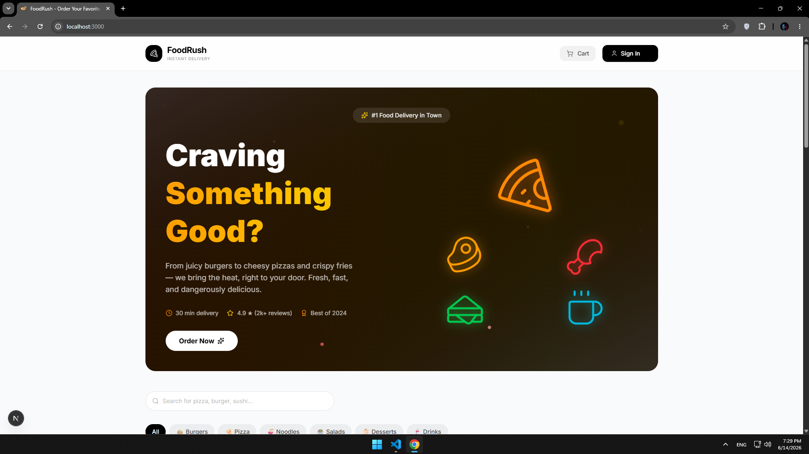
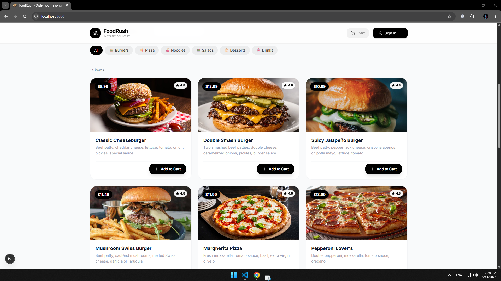
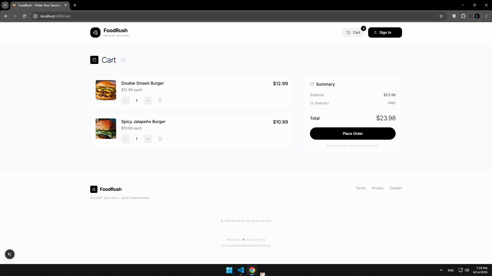
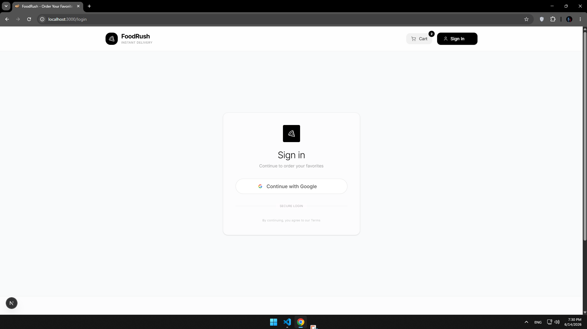
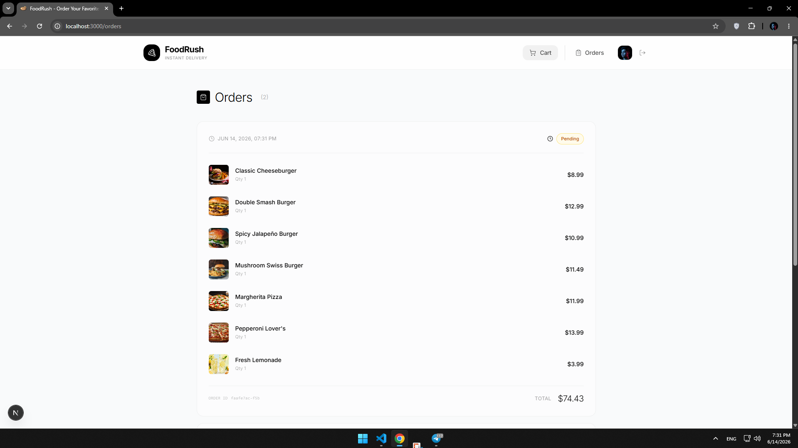
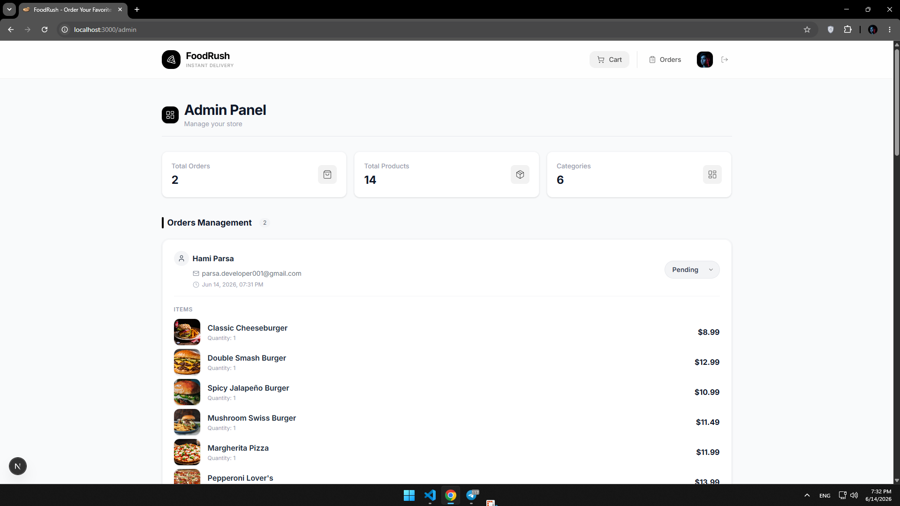
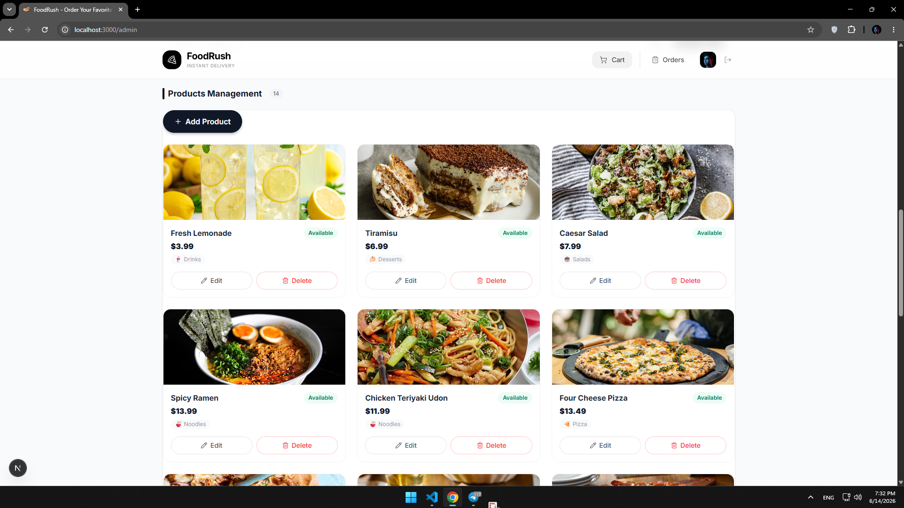
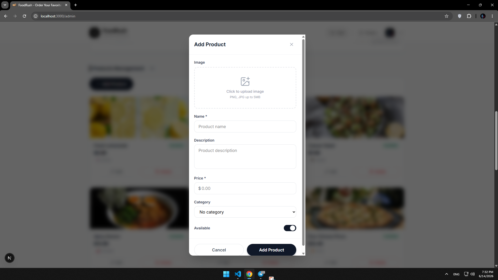

<div align="center">
  
  <h1>🍽️ FoodRush</h1>
  <p><b>Order food. Enjoy life.</b> — A full-stack food ordering platform built from scratch.</p>

  
  
  
  
  
</div>

---

## 🚀 About FoodRush

**FoodRush** is a production-ready, full-stack food ordering web application. Users can browse the menu, filter by category, add items to their cart, and place orders — all with a clean, fast, and modern UI.

Built with the latest **Next.js 14 App Router**, fully typed with **TypeScript**, styled with **Tailwind CSS**, powered by **Supabase** for backend & auth, and managed with **Zustand** for global state.

> This is not a tutorial clone. This is a real-world full-stack project — with authentication, database, file storage, admin panel, and order management.

---

## ✨ Features

### 👤 User Side
- 🔐 **Google OAuth** — Sign in with one click via Google
- 🍔 **Browse Menu** — View all available dishes with images, descriptions & prices
- 🗂️ **Category Filter** — Filter dishes by category (Burgers, Pizza, Noodles, etc.)
- 🔍 **Live Search** — Search for dishes in real-time
- 🛒 **Smart Cart** — Add, remove, increase/decrease quantities with Zustand state
- ✅ **Place Orders** — Confirm orders which are saved directly to the database
- 📦 **Order History** — View all past orders with items, prices & status

### 🛠️ Admin Panel
- 🔒 **Secure Access** — Only accessible by the owner's email
- ➕ **Add Products** — Add new dishes with name, description, price, category & image
- ✏️ **Edit Products** — Update any product details or image
- 🗑️ **Delete Products** — Remove products instantly
- 📋 **Manage Orders** — View all customer orders and update their status (Pending → Preparing → Delivered)
- 🖼️ **Image Upload** — Upload product images directly to Supabase Storage

---

## 🧠 Tech Stack

| Layer | Technology | Purpose |
|-------|-----------|---------|
| 🖥️ **Frontend** | Next.js 14 (App Router) | SSR, routing, API routes |
| 🟦 **Language** | TypeScript | Type safety across the entire app |
| 🎨 **Styling** | Tailwind CSS | Fast, responsive, utility-first styling |
| 🗄️ **Database** | Supabase (PostgreSQL) | Tables, RLS policies, real-time data |
| 🔐 **Auth** | Supabase Auth + Google OAuth | Secure sign-in with Google |
| 🗂️ **Storage** | Supabase Storage | Product image uploads & hosting |
| 🧠 **State** | Zustand | Lightweight global cart state |
| 🔣 **Icons** | Lucide React | Clean, consistent icon set |

---

## 🗄️ Database Schema
profiles        → stores user info synced from Google OAuth

categories      → product categories (Burgers, Pizza, etc.)

products        → menu items with name, price, image, category

orders          → customer orders with status tracking

order_items     → individual items within each order

All tables are protected with **Row Level Security (RLS)** policies.
---

## 🖼️ Project Preview

<div align="center">
  
  <br/><br/>
  
  <br/><br/>
  
  <br/><br/>
  
  <br/><br/>
  
  <br/><br/>
  
  <br/><br/>
  
  <br/><br/>
  
</div>


---

## 📁 Project Structure
```
src/
├── app/
│   ├── page.tsx              ← Home page (menu + search + filter)
│   ├── login/
│   │   └── page.tsx          ← Google OAuth login
│   ├── cart/
│   │   └── page.tsx          ← Cart + place order
│   ├── orders/
│   │   └── page.tsx          ← Order history
│   ├── admin/
│   │   └── page.tsx          ← Admin panel
│   └── auth/
│       └── callback/
│           └── route.ts      ← OAuth callback handler
├── components/
│   ├── Header.tsx
│   ├── Footer.tsx
│   ├── ProductCard.tsx
│   ├── CartDrawer.tsx
│   ├── AdminProducts.tsx
│   └── AdminOrders.tsx
├── lib/
│   ├── supabase/
│   │   ├── client.ts
│   │   ├── server.ts
│   │   └── middleware.ts
│   └── store/
│       └── cartStore.ts
└── types/
    └── index.ts
</code>
```
---

## ⚙️ Getting Started

### 1. Clone the repo

```bash
git clone https://github.com/yourusername/foodrush.git
cd foodrush
```

### 2. Install dependencies

```bash
npm install
```

### 3. Set up environment variables

Create a `.env.local` file in the root:

```env
NEXT_PUBLIC_SUPABASE_URL=your_supabase_project_url
NEXT_PUBLIC_SUPABASE_PUBLISHABLE_KEY=your_supabase_publishable_key
ADMIN_EMAIL=your_admin_email@gmail.com
NEXT_PUBLIC_ADMIN_EMAIL=your_admin_email@gmail.com
```

### 4. Set up Supabase

- Create a new Supabase project
- Run the SQL migrations (tables + RLS policies) from `/supabase/schema.sql`
- Enable Google OAuth under **Authentication → Providers → Google**
- Create a **Storage bucket** named `products` (public)

### 5. Run the dev server

```bash
npm run dev
```

Open [http://localhost:3000](http://localhost:3000) 🚀

---

## 🔐 Security

- All database tables are protected with **Row Level Security**
- Users can only view and create their own orders
- Admin panel is restricted to a single authorized email
- Google OAuth handles all authentication — no passwords stored

---


## 👨‍💻 Author

**Developed by:** [HamiParsa](https://github.com/HamiParsa)
💬 Full-Stack Developer | Building real-world projects with modern web technologies

---

<div align="center">
  
  <br/><br/>
  <i>Built with ❤️ and a lot of ☕</i>
</div>
